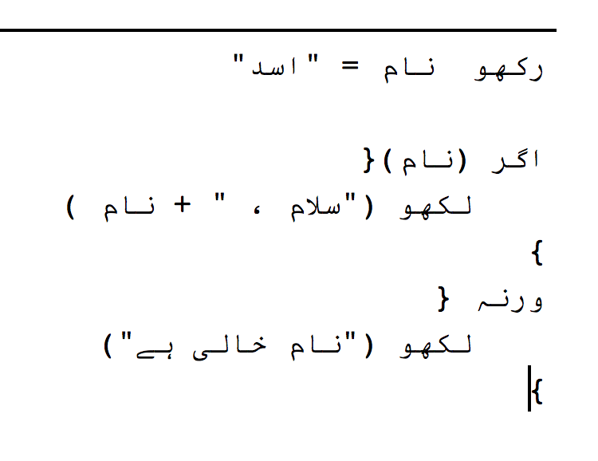
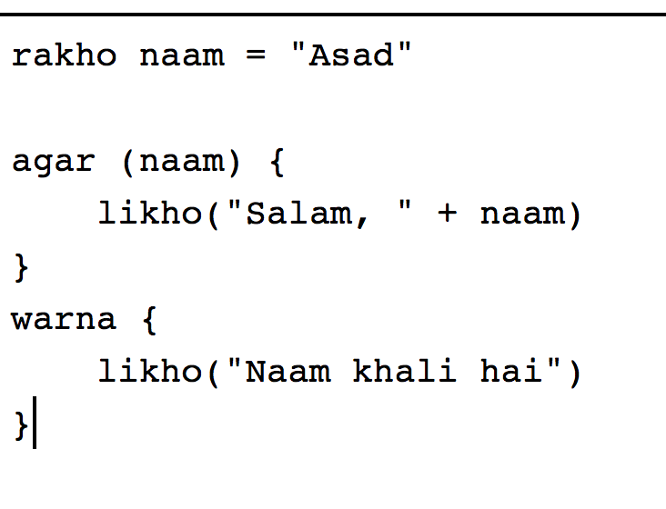

# UrduScript - Urdu Mein Programming 

UrduScript ek programming language hai. Iska goal naye programmers k liye programming ko asaan banana ha. UrduScript informal Urdu use karti hai jis se naye programmers k liye programming concepts asaan hojate hen.

UrduScript transpile ho k JavaScript banjati hai. Apke saray JavaScript frameworks (jese jQuery, UnderScore, React, etc) iske saath use keeye jasakte hen.

## Hello Dunya

```js
// declare variable
rakho naam = "Asad"

// output to console
likho("Hello, " + naam)
```


### [Online Try Karen!](https://asadmemon.com/urduscript/editor/)

## Kyun?

If you are an experienced programmer, you might find this stupid. Per ye apke liye nahin hai. 

Remember learning programming for the first time? Remember the analogy of `variable` being a box jis mein value rakhte hen. UrduScript is based on those analogies to the core. Removing friction for new programmers.

Let me explain with an example, imagine explaining the following code to a very new learner:

```js
var name = "Ali"
console.log("Hello, " + name)
```

You will have to first convey the box analogy, then you will need to explain what a *console* is and what *log* is. And then finally how we concat the output.

This is the UrduScript equivalent:

```js
rakho naam = "Ali"
likho("Hello, " + naam)
```

Imagine explaining this to a new programmer, when you explain the variable/box analogy, `rakho` fits right in. 
ie. We are making a box called `naam` and usmein `"Ali"` rakhrahe hen.

`likho()` is also pretty self-explanatory too.

You get the idea. UrduScript is based on this concept.

## Pure اردو kyu nahin?

As much as I wanted to. Here are few reasons:

- Persian-like alphabets are not native to our keyboard.
- The default non-nastaliq font is hard to read.
- Right-to-left code style is horrible.
- Newer generation is adapting Urdish rapidly. 


To prove my point, here is a RTL pseudo-code hello world:



See what I mean? The font is bad. RTL is hard to understand. Also typing this was less natural than Urdish:




## Other Examples

### For Each

```js
// variable
rakho list = ["Ahmed", "Ali", "Qasim"]

// foreach loop. Iterate over 'list' array
har list k naam per{
  // output to screen
  likho(naam)
}
```

### If-Else

```js
// declare variable
rakho naam = "Asad"

// if else
agar (naam){
  likho("Salam, " + naam)
}
warna {
  likho("Naam khali hai")
}
```

### Prompt

```js
//prompt: ask for input from user
rakho naam = pucho("Apna naam likhen")

// if else
agar (naam){
  likho("Salam, " + naam)
}
warna {
  likho("Naam khali hai")
}
```

### Function

```js
// function is 'kaam'
kaam salaam(naam){
	agar (naam){
    likho("Salam, " + naam)
  }
  warna {
    likho("Naam khali hai")
  }
}

// calling function
salaam("Ali")
```

### While

```js
// declare a variable
rakho a = 10

// while is 'jabtak'
jabtak( a>0 ){
	likho(a)
	a--
}
```

### Do-While

```js
// ask age until given
karo{
  age = pucho("Apni age likhen")
}
jabtak(!age)
likho("Apki age " + age + " hai")
```


### If-Elseif-Else

```js
// declare variable
rakho naam = "Asad"

// if elseif else
agar (naam === "Asad"){
  likho("Salam, " + naam)
}
warnaagar (naam === "John"){
  likho("Hello, " + naam)
}
warna {
  likho("Naam khali hai")
}
```

### Recursion (Fibonacci)
```js
// recursive function
kaam fibonacci(num) {
  // base case
  agar (num <= 1) bhejo 1;
	
  // recursion
  bhejo fibonacci(num - 1) + fibonacci(num - 2);
}

likho(fibonacci(5))
```


## Contribute

You can contribute even if you think you are not a programmer. Please read [this guide](contribute).

Here are some contributors of the language:

- Ali Alavi
- Eric Bhatti
- Azka Qaiser
- Junaid Sarfraz
- Mehmood Memon
- Pavan Kumar
- Muhammad Asif
- Ahmed Jawed
- Harris Irfan
- Zayn-ul-abdin
- Mubashar Iqbal
- M Shaharyar Siddiqui
- Areeba
- Ahmer
- Muhammad Zaid Ikhlas
- Mian Asad
- Junaid Nadeem
- Shahan
- Muhammad Noman
- Ahsan Sohail
- Majid Razvi
- Hammad Siddiqui

## [Source Code](https://github.com/asadm/urduscript)

I have released the [code](https://github.com/asadm/urduscript) under MIT License. ⭐ the repo while you are there :P

The transpiler is written in JavaScript using [Sweet.js](https://github.com/sweet-js/sweet-core).